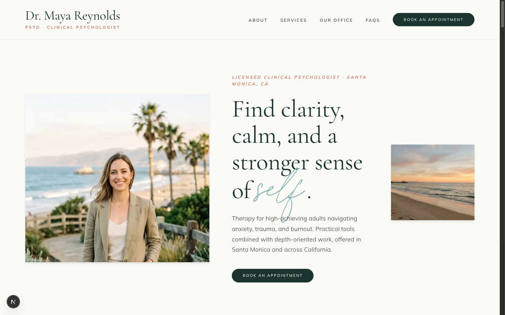
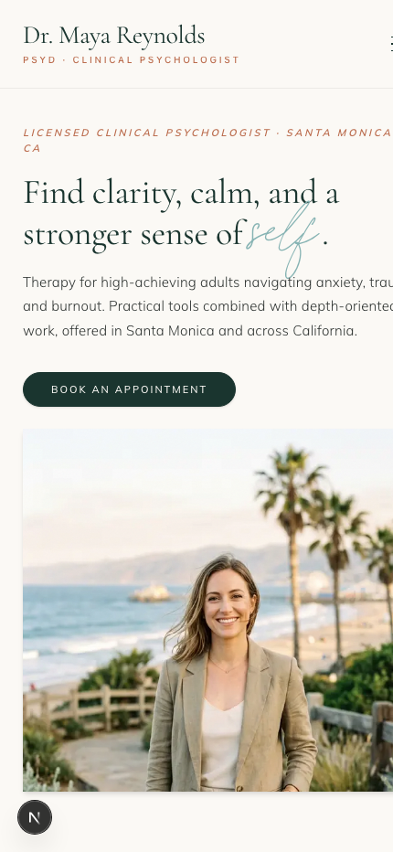
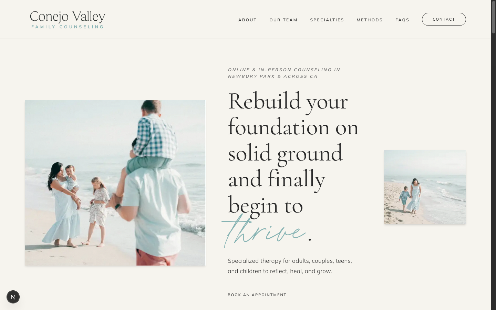
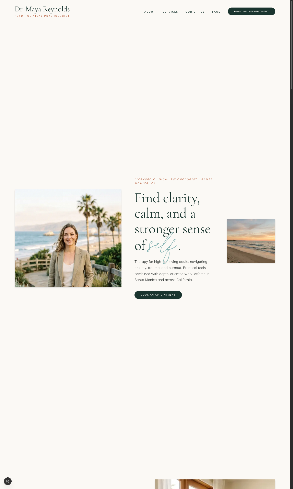

# Dr. Maya Reynolds, PsyD — Therapy Practice & Conejo Valley UI Clone

[](https://maya-reynolds-therapy-tau.vercel.app)
[](https://maya-reynolds-therapy-tau.vercel.app/clone)
[](https://github.com/rohanrjoshii/maya-reynolds-therapy)

Built for **Stage 2: Internship Selection Process (Grow My Therapy)** — Front-End Developer Internship.

---

## 🌐 Live Website Links

- **Creative Redesign (Production)**: [https://maya-reynolds-therapy-tau.vercel.app](https://maya-reynolds-therapy-tau.vercel.app)
- **1:1 Conejo Valley Homepage Clone**: [https://maya-reynolds-therapy-tau.vercel.app/clone](https://maya-reynolds-therapy-tau.vercel.app/clone)
- **GitHub Repository**: [https://github.com/rohanrjoshii/maya-reynolds-therapy](https://github.com/rohanrjoshii/maya-reynolds-therapy)

---

## 📸 Screenshots

### 1. Creative Redesign — Desktop Hero


### 2. Mobile Responsive View
<p align="center">
  
</p>

### 3. 1:1 UI Clone of Conejo Valley Family Counseling


### 4. Full Page Redesign


---

## 🛠️ Tech Stack & Implementation Details

- **Framework**: Next.js 16 (App Router + Turbopack)
- **Styling**: Tailwind CSS with CSS Custom Variables for dynamic token switching
- **Typography**:
  - Display: `Cormorant Garamond` & `Cormorant Infant`
  - Body: `Mulish`
  - Accents: Authentic `PrintedMoments` handwriting font sampled directly from the original Squarespace source
- **Component Architecture**:
  - `Header.tsx`: Full-width responsive navigation with rounded-full pill outline CTA button and mobile sheet drawer.
  - `HeroSection.tsx`: 3-column asymmetric layout (41% left photo, 37% center copy, 21% right balanced photo).
  - `HowWeWorkSection.tsx`: Editorial dual-column narrative for approach, specialties, and clinical modalities.
  - `ServicesSection.tsx`: 3 core clinical services extracted directly from Dr. Maya Reynolds' profile.
  - `AboutSection.tsx`: Authentic portrait of Dr. Maya Reynolds (used exactly once) with her bio, credentials, and clinical philosophy.
  - `OurOfficeSection.tsx`: **[Part 3 Custom Section]** 2x2 asymmetric gallery showcasing real office photos (`office1.jpeg`, `office2.jpeg`), Santa Monica location details, and hybrid therapy options.
  - `FaqSection.tsx`: Interactive accessible accordions addressing fees, insurance, out-of-network superbills, and session formats.
  - `ContactSection.tsx` & `Footer.tsx`: Complete contact form, Santa Monica office coordinates, and warm coastal footer.

---

## ✅ Stage 2 Assignment Audit & Checklist

### Part 1: Clone the Homepage (UI Accuracy Test)
- [x] **Identical Layout & Structure**: Recreated the asymmetric 3-column hero, editorial typography, rounded button geometry, and section order matching [Conejo Valley Family Counseling](https://www.conejovalleycounseling.com/home).
- [x] **Fully Responsive**: Verified on Desktop (1440px+), Laptop (1024px), Tablet (768px), and Mobile (390px/430px).
- [x] **Typography & Styling**: Embedded authentic `PrintedMoments` handwritten accents, `#86B3B3` seafoam palette, and `Mulish` body.
- [x] **Preserved on `/clone`**: The original clone is fully preserved and instantly accessible at [`/clone`](https://maya-reynolds-therapy-tau.vercel.app/clone).

### Part 2: Redesign Using Dr. Maya Reynolds' Profile
- [x] **Theme & Color Palette**: Replaced the original palette with a cohesive coastal clay & forest theme:
  - Primary: Deep Pine Forest (`#1A352F`)
  - Secondary / Accent: Coastal Clay & Warm Terracotta (`#BA6A4B`)
  - Backgrounds: Warm Alabaster (`#FBF9F5`) and Sand (`#F3ECE2`)
  - Contrast: Exceeds WCAG AA readability standards (12.5:1+).
- [x] **Copywriting & Single Source of Truth**:
  - Strictly derived from Dr. Maya Reynolds, PsyD's profile.
  - H1 & Headings: Local SEO optimized for Santa Monica, CA, and West Los Angeles.
  - 3 Core Services:
    1. *Anxiety & Panic Disorders* (somatic regulation, exposure-based work, panic desensitization)
    2. *Trauma & C-PTSD Recovery* (somatic experiencing, gentle pacing, boundary repair)
    3. *Burnout & High-Achiever Stress* (perfectionism unhooking, sustainable living, ACT)
  - About & FAQs: Details on PsyD doctorate, California license, superbill reimbursement, session fees ($200–$275), and in-person/telehealth options.
- [x] **Intentional Imagery**:
  - Replaced all images with high-resolution coastal, calming Santa Monica themes.
  - **Single Maya Portrait**: Dr. Maya Reynolds' official portrait is featured only once in the About section.
  - 100% unique images across every single section (zero duplicates).

### Part 3: Custom "Our Office" Section
- [x] **Original New Section**: Designed an editorial "Our Office: A Calm Space for Healing in Santa Monica" section not found in the original template.
- [x] **Authentic Office Photos**: Embedded the actual office photography (`office1.jpeg` and `office2.jpeg`) from the profile document.
- [x] **Physical Practice Details**: Highlighted 123th St 45 W Santa Monica location, privacy, natural sunlight, comfortable seating, and hybrid session availability.
- [x] **Seamless Design Integration**: Perfectly inherits site typography, responsive spacing, and coastal clay palette.

---

## 🚀 Running Locally

```bash
# Clone the repository
git clone https://github.com/rohanrjoshii/maya-reynolds-therapy.git
cd maya-reynolds-therapy

# Install dependencies
npm install

# Start local dev server
npm run dev
```

Open `http://localhost:3000` for the Redesign or `http://localhost:3000/clone` for the Clone.
